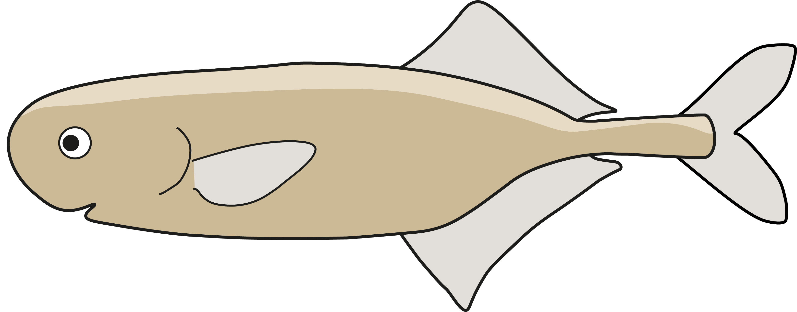
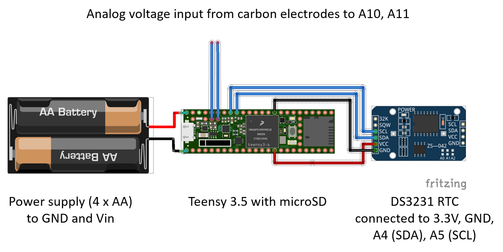

<!--
*** Thanks for checking out this README Template. If you have a suggestion that would
*** make this better, please fork the repo and create a pull request or simply open
*** an issue with the tag "enhancement".
*** Thanks again! Now go create something AMAZING! :D
***
***
***
*** To avoid retyping too much info. Do a search and replace for the following:
*** muchaste, EOD-logger, @SBiosci, stefan.mucha@hu-berlin.de
-->

<!-- PROJECT SHIELDS -->
<!--
*** I'm using markdown "reference style" links for readability.
*** Reference links are enclosed in brackets [ ] instead of parentheses ( ).
*** See the bottom of this document for the declaration of the reference variables
*** for contributors-url, forks-url, etc. This is an optional, concise syntax you may use.
*** https://www.markdownguide.org/basic-syntax/#reference-style-links

[![Contributors][contributors-shield]][contributors-url]
[![Forks][forks-shield]][forks-url]
[![Stargazers][stars-shield]][stars-url]
[![Issues][issues-shield]][issues-url]
[![MIT License][license-shield]][license-url]
[![LinkedIn][linkedin-shield]][linkedin-url]
-->

<!-- PROJECT LOGO -->
 

  

  <h3 align="center">EOD-logger</h3>

  

    A microcontroller based recording device for electric signals from weakly electric fish.
     
    <a href="https://github.com/muchaste/EOD-logger"><strong>Explore the docs »</strong></a>
     
     
    <a href="https://github.com/muchaste/EOD-logger">View Demo</a>
    ·
    <a href="https://github.com/muchaste/EOD-logger/issues">Report Bug</a>
    ·
    <a href="https://github.com/muchaste/EOD-logger/issues">Request Feature</a>
  

<!-- TABLE OF CONTENTS -->
## Table of Contents

* [About the Project](#about-the-project)
  * [Overview: EOD-logger v1](#overview-eod-logger-v1)
  * [Built With](#built-with)
* [Getting Started](#getting-started)
  * [Prerequisites](#prerequisites)
  * [Installation](#installation)
* [Usage](#usage)
* [Roadmap](#roadmap)
* [Contributing](#contributing)
* [License](#license)
* [Contact](#contact)
* [Acknowledgements](#acknowledgements)

<!-- ABOUT THE PROJECT -->
## About The Project
Weakly electric fishes emit constant or intermittent electric organ discharges to communicate and navigate. These discharges can be recorded by sampling the voltage in the water surrounding the fish. Due to the short duration of some EODs, a sample rate of up to 100 kHz is necessary to record these signals.
The purpose of this project is to design a cheap and easy-to-use recording device that can autonomously record the signals of weakly electric fish.

### Overview: EOD-logger v1
The first field-tested version of the logger (eodlogger_v1) uses no amplification or frequency filters and takes direct analog input from carbon electrodes.
Voltage is measured in differential mode and written to the onboard buffer using DMA channels. A DS3231 RTC chip is used to keep track of the time. Every 10 minutes, the recorded data is written as .bin file onto the microSD card using the timestamp as filename.

### Built With
**Core components:**
* [Teensy 3.5](https://www.pjrc.com/store/teensy35.html)
* [Arduino GUI v. 1.8.8](https://www.arduino.cc/en/main/OldSoftwareReleases)
* [Teensyduino Addon](https://www.pjrc.com/teensy/td_download.html)

**Material for assembly of EOD logger (v1):**
* Timekeeping: DS3231 Real-time clock
* Storage: 32 GB microSD card
* Power: 4 x AA batteries
* Electrode material: Carbon discs
* Housing: PVC tube

<!-- GETTING STARTED -->
## Getting Started

### Prerequisites
* Install the Arduino GUI and Teensyduino Addon

### Installation

1. Clone the repo or download the eodlogger_v1.ino sketch

2. Adjust the sketch to your needs (see comments in sketch).

3. Wire the components as can be seen below:

4. Set the RTC clock using the "SetTime" Sketch from the DS1317RTC library examples (this also works with the DS3231 chip)

5. Upload the eodlogger_v1.ino 

<!-- USAGE EXAMPLES -->
## Usage

As soon as the EOD-logger is powered up, it will run through its startup routine. If everything checks out (SD card found, RTC responds), the onboard LED on the Teensy blinks 5 times. From this point, the logger records continuously voltage and stores the values on the SD card until you turn it off, energy runs out or the SD card is full.

<!-- ROADMAP -->
## Roadmap

See the [open issues](https://github.com/muchaste/EOD-logger/issues) for a list of proposed features (and known issues).

### EODlogger v2
We are currently developing hardware and software enhancements (amplifier and filter shield) to extend the useability of the EOD logger.
Planned changes could include:
* Amplification, low-pass and high-pass filtering of signals before recording
* Differential amplification: use only analog input to record differential voltage -> record two channels
* Reduced battery usage/powerbank as power source
* GPS module

### Two channel recording
[Prof. Jan Benda](https://bendalab.github.io/) and Lydia Federman have contributed a first sketch to record two analog channels (single-ended). Find their contribution here:
[https://github.com/muchaste/EOD-Logger/tree/master/eodlogger-2channel](https://github.com/muchaste/EOD-Logger/tree/master/eodlogger-2channel).

<!-- CONTRIBUTING -->
## Contributing

This is an open project that can only benefit from the contributions of any commited eFish researcher. Any contributions you make are **greatly appreciated**.

1. Fork the Project
2. Create your Feature Branch (`git checkout -b feature/AmazingFeature`)
3. Commit your Changes (`git commit -m 'Add some AmazingFeature'`)
4. Push to the Branch (`git push origin feature/AmazingFeature`)
5. Open a Pull Request

<!-- LICENSE -->
## License

Distributed under the MIT License. See `LICENSE` for more information.

<!-- CONTACT -->
## Contact

Stefan Mucha - [@@SBiosci](https://twitter.com/@SBiosci) - stefan.mucha@hu-berlin.de

Project Link: [https://github.com/muchaste/EOD-logger](https://github.com/muchaste/EOD-logger)

<!-- ACKNOWLEDGEMENTS -->
## Acknowledgements

* [Prof. Rüdiger Krahe](https://www.biologie.hu-berlin.de/en/gruppenseiten-en/vhphysiol)
* [Prof. Jan Benda](https://bendalab.github.io/)
* Leon Marquardt
* The [Teensy](https://forum.pjrc.com/) and [Arduino](https://forum.arduino.cc/) community

<!-- MARKDOWN LINKS & IMAGES -->
<!-- https://www.markdownguide.org/basic-syntax/#reference-style-links -->
<!-- [contributors-shield]: https://img.shields.io/github/contributors/muchaste/repo.svg?style=flat-square
[contributors-url]: https://github.com/muchaste/repo/graphs/contributors
[forks-shield]: https://img.shields.io/github/forks/muchaste/repo.svg?style=flat-square
[forks-url]: https://github.com/muchaste/repo/network/members
[stars-shield]: https://img.shields.io/github/stars/muchaste/repo.svg?style=flat-square
[stars-url]: https://github.com/muchaste/repo/stargazers
[issues-shield]: https://img.shields.io/github/issues/muchaste/repo.svg?style=flat-square
[issues-url]: https://github.com/muchaste/repo/issues
[license-shield]: https://img.shields.io/github/license/muchaste/repo.svg?style=flat-square
[license-url]: https://github.com/muchaste/repo/blob/master/LICENSE.txt
[linkedin-shield]: https://img.shields.io/badge/-LinkedIn-black.svg?style=flat-square&logo=linkedin&colorB=555
[linkedin-url]: https://linkedin.com/in/muchaste
[product-screenshot]: images/screenshot.png -->
