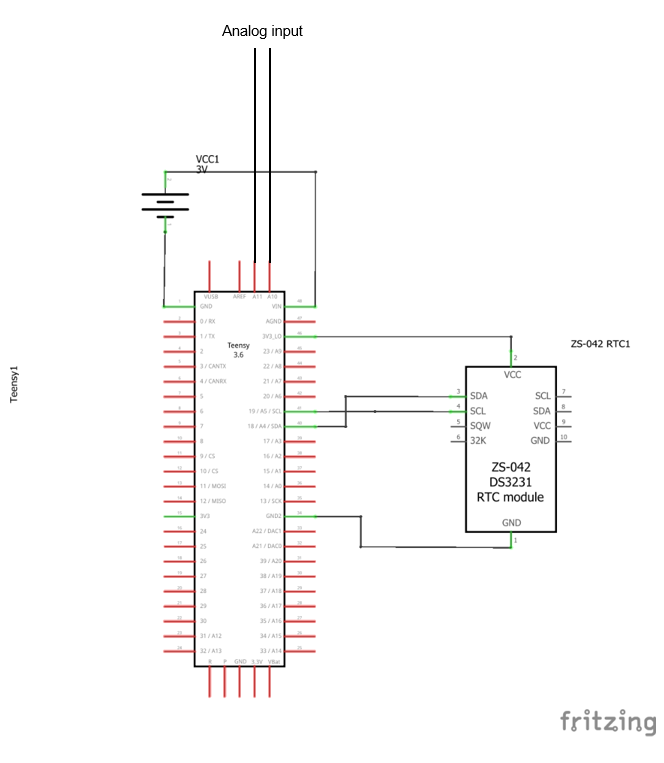

<!--
*** Thanks for checking out this README Template. If you have a suggestion that would
*** make this better, please fork the repo and create a pull request or simply open
*** an issue with the tag "enhancement".
*** Thanks again! Now go create something AMAZING! :D
***
***
***
*** To avoid retyping too much info. Do a search and replace for the following:
*** muchaste, EOD-logger, @SBiosci, stefan.mucha@hu-berlin.de
-->

<!-- PROJECT SHIELDS -->
<!--
*** I'm using markdown "reference style" links for readability.
*** Reference links are enclosed in brackets [ ] instead of parentheses ( ).
*** See the bottom of this document for the declaration of the reference variables
*** for contributors-url, forks-url, etc. This is an optional, concise syntax you may use.
*** https://www.markdownguide.org/basic-syntax/#reference-style-links
-->
[![Contributors][contributors-shield]][contributors-url]
[![Forks][forks-shield]][forks-url]
[![Stargazers][stars-shield]][stars-url]
[![Issues][issues-shield]][issues-url]
[![MIT License][license-shield]][license-url]

<!-- PROJECT LOGO -->
 

  

  <h3 align="center">EOD-logger</h3>

  

    A microcontroller based recording device for electric signals from weakly electric fish.
     
    <a href="https://github.com/muchaste/EOD-logger"><strong>Explore the docs »</strong></a>
     
     
    <a href="https://github.com/muchaste/EOD-logger#getting-started">Get Started</a>
    ·
    <a href="https://github.com/muchaste/EOD-logger/issues">Report Bug</a>
    ·
    <a href="https://github.com/muchaste/EOD-logger/issues">Request Feature</a>
    .
    <a href="https://github.com/muchaste/EOD-logger#contributing">Contribute</a>
  

<!-- TABLE OF CONTENTS -->
## Table of Contents

* [About the Project](#about-the-project)
  * [Version Overview](#version-overview)
  * [Built With](#built-with)
* [Getting Started](#getting-started)
  * [Prerequisites](#prerequisites)
  * [Installation](#installation)
* [Usage](#usage)
* [Roadmap](#roadmap)
* [Contributing](#contributing)
* [License](#license)
* [Contact](#contact)
* [Acknowledgements](#acknowledgements)

<!-- ABOUT THE PROJECT -->
## About The Project
Weakly electric fishes emit constant or intermittent electric organ discharges to communicate and navigate. These discharges can be recorded by sampling the voltage in the water surrounding the fish. Due to the short duration of some EODs, a sample rate of up to 100 kHz is necessary to record these signals.
The purpose of this project is to design a cheap and easy-to-use recording device that can autonomously record the signals of weakly electric fish.

### Version Overview
* eodlogger_v1: The first field-tested version of the logger. Used with direct analog input from carbon electrodes to ADC0 and ADC1. Voltage is measured in differential mode and written to the onboard buffer using DMA channels. A DS3231 RTC chip is used to keep track of the time. Every 10 minutes, the recorded data is written as .bin file onto the microSD card using the timestamp as filename.
* eodlogger_1channel_diff_barebone: simplification of eodlogger_v1, runs without RTC chip, mostly for testing purposes.
* eodlogger_1channel_diff_DS3231: developed version of eodlogger_v1, uses up-to-date libraries and supports exFat formatted SD cards. Reads voltage from ADC0 and ADC1 as differential input, saves data as .bin every 10, creates metadata .txt file with recording information (location, sample rate, experimenter, ...)
* eodlogger_1channel_singleended_barebone: single-ended version of the 1channel_diff_barebone sketch, mostly for development or testing purposes.
* eodlogger-2channel: First two channel recording sketch developed by Lydia Federman to explore simultaneous recording on both ADCs. Includes online analysis functions that are currently under development.
* eodlogger_2channel_barebone: Simplified and updated two channel recording sketch. Reads voltage separately from two single-ended inputs into ADC0 and ADC1, saves one .bin file per ADC. Mostly for testing purposes.
* eodlogger_2channel_DS3231: Developed version of the barebone sketch, includes timestamps from RTC and creates metadata .txt file in addition to the .bin files (analogous to eodlogger_1channel_diff_DS3231).
* eodlogger_8channel: Latest development by Sebastian Volkmer. Uses multiplexing to read 8 inputs simultaneously (4 per ADC). Saves recordings as .wav files with encoded metadata.

### Built With
**Core components:**
* [Teensy 3.5](https://www.pjrc.com/store/teensy35.html)
* [Arduino GUI v. 1.8.8](https://www.arduino.cc/en/main/OldSoftwareReleases)
* [Teensyduino Addon](https://www.pjrc.com/teensy/td_download.html)

**Material for assembly of EOD logger (v1):**
* Timekeeping: DS3231 Real-time clock
* Storage: 32 GB microSD card
* Power: 4 x AA batteries
* Electrode material: Carbon discs
* Housing: PVC tube

<!-- GETTING STARTED -->
## Getting Started

### Prerequisites
* Install the Arduino GUI and Teensyduino Addon

### Where to start?
Which sketch you need depends on your application - do you want to record on one or several channels? Do you want to read differential or single-ended input? The following sketches are the most up-to-date versions that cover most applications
* 1-Channel differential recording: eodlogger_1channel_diff_DS3231
* 2-Channel single-ended: eodlogger_2channel_DS3231
* 8-Channel single-eded: eodlogger_8channel

For testing purposes, the barebone versions of the 1- and 2-Channel sketches are recommended, as they don't use an RTC.

### Installation

1. Clone the repo or download the sketch that suits your needs.

2. Adjust the sketch to your needs (see comments in sketch).

3. Wire the components. An example for a simple configuration (no amp, differential input directly from electrodes) can be seen below:

4. If you use an RTC clock, set the RTC clock using the "SetTime" Sketch from the DS1317RTC library examples (this also works with the DS3231 chip)

5. Upload the sketch to the teensy and start recording.

<!-- USAGE EXAMPLES -->
## Usage

The loggers store continuous analog voltage readings on the onboard SD card of the Teensy 3.5. Operation duration depends on power supply capacity, storage capacity, sample rate and number of channels. With an autonomous voltage supply (e.g. a powerbank) and a waterproof housing, the loggers can be deployed in any aquatic system and monitor electrical activity.

*Test your configuration before going full Jacques Cousteau. Expect everything that can go wrong, to actually go wrong.*

This may sound trivial but it is probably the most precious advice I can give. There are many pitfalls hidden in DIY projects such as this one here. Here are some that I encountered on my first sampling trip:
* Cables came loose
* Water entered my loggers' housing when water temperature and pressure changed over night
* Waves and water current shook the loggers so violently that they stopped logging (probably some power supply contact issue)
* Someone took them (have enough of them with you!)  

<!-- ROADMAP -->
## Roadmap

See the [open issues](https://github.com/muchaste/EOD-logger/issues) for a list of proposed features (and known issues).

### Developments
We are currently developing hardware and software enhancements (amplifier and filter shield) to extend the useability of the EOD logger.
Planned changes could include:
* Amplification, low-pass and high-pass filtering of signals before recording
* Differential amplification: use only analog input to record differential voltage -> record two channels
* Reduced battery usage/powerbank as power source
* GPS module

### Multiple channel recording
[Prof. Jan Benda](https://bendalab.github.io/) and Lydia Federman have contributed a first sketch to record two analog channels (single-ended). Sebastian Volkmer has developed and contributed an 8-channel recording sketch!!

<!-- CONTRIBUTING -->
## Contributing

This is an open project that can only benefit from the contributions of interested researchers. Any contributions you make are **greatly appreciated**.

1. Fork the Project
2. Create your Feature Branch (`git checkout -b feature/AmazingFeature`)
3. Commit your Changes (`git commit -m 'Add some AmazingFeature'`)
4. Push to the Branch (`git push origin feature/AmazingFeature`)
5. Open a Pull Request

<!-- LICENSE -->
## License

Distributed under the MIT License. See `LICENSE` for more information.

<!-- CONTACT -->
## Contact

Stefan Mucha - [@SBiosci](https://twitter.com/SBiosci) - stefan.mucha@hu-berlin.de

Project Link: [https://github.com/muchaste/EOD-logger](https://github.com/muchaste/EOD-logger)

<!-- ACKNOWLEDGEMENTS -->
## Acknowledgements
This project has become possible thanks to the following supervisors, contributors and supporters:
* [Prof. Rüdiger Krahe](https://www.biologie.hu-berlin.de/en/gruppenseiten-en/vhphysiol)
* [Prof. Jan Benda](https://bendalab.github.io/)
* Leon Marquardt
* Lydia Federman
* Sebastian Volkmer
* The [Teensy](https://forum.pjrc.com/) and [Arduino](https://forum.arduino.cc/) community

<!-- MARKDOWN LINKS & IMAGES -->
<!-- https://www.markdownguide.org/basic-syntax/#reference-style-links -->
[contributors-shield]: https://img.shields.io/github/contributors/muchaste/EOD-logger.svg?style=flat-square
[contributors-url]: https://github.com/muchaste/EOD-Logger/graphs/contributors
[forks-shield]: https://img.shields.io/github/forks/muchaste/EOD-logger.svg?style=flat-square
[forks-url]: https://github.com/muchaste/EOD-Logger/network/members
[stars-shield]: https://img.shields.io/github/stars/muchaste/EOD-logger.svg?style=flat-square
[stars-url]: https://github.com/muchaste/EOD-logger/stargazers
[issues-shield]: https://img.shields.io/github/issues/muchaste/EOD-logger.svg?style=flat-square
[issues-url]: https://github.com/muchaste/EOD-logger/issues
[license-shield]: https://img.shields.io/github/license/muchaste/EOD-logger.svg?style=flat-square
[license-url]: https://github.com/muchaste/EOD-logger/blob/master/LICENSE.txt

